<h1 align="center">TryHackMe Tutorial</h1>
<h2 align="center">Skynet<br>Room link: https://tryhackme.com/room/skynet</h2>

<h3 align="center">Dedicated to all the legends on our Discord channel - CyberSamurai</h3><br>

<p align="center"> 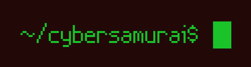</p><br>

<p align="center"> </p><br>


<h1> Enumeration </h1>
<h3>NMAP</h3>
<p>First, we start with the CLASSIC nmap scan</p>

```bash
nmap -T4 -p- -A [targetIP]
```
*[targetIP] being the IP of Skynet CTF*
<p align="center"> 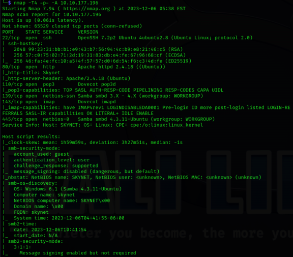</p>

**Open Ports:**<br>
22/tcp  open  ssh         OpenSSH 7.2p2 Ubuntu 4ubuntu2.8 (Ubuntu Linux; protocol 2.0)<br>
80/tcp  open  http        Apache httpd 2.4.18 ((Ubuntu))<br>
110/tcp open  pop3        Dovecot pop3d<br>
139/tcp open  netbios-ssn Samba smbd 3.X - 4.X (workgroup: WORKGROUP)<br>
143/tcp open  imap        Dovecot imapd<br>
445/tcp open  netbios-0   Samba smbd 4.3.11-Ubuntu (workgroup: WORKGROUP)<br><br>

Okay, so we have webserver being hosted on port 80, OpenSSH on port 22 and Samba File Share on port 139/445. Ports 110 and port 143 do not interest me just as yet. We'll see.

Let's investigate port 80 first.<br><br>

<h2>Port 80 (HTTP)</h2>
Navigating to the webserver using the IP Address of the target machine (in this case 10.10.177.196) on a browser of your choice, you get the below:<br>
<p align="center"> 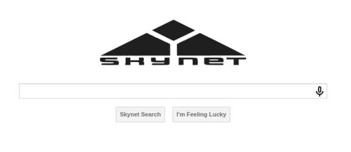</p><br>

This looks like a search engine, which does nothing when you search or when you click the buttons.<br>

Viewing the Page Source also does not disclose any information.

<h3>GOBUSTER</h3>

```bash
gobuster dir -u http://[targetIP]/ -w /usr/share/dirbuster/wordlists/directory-list-2.3-small.txt
```
<p align="center"> 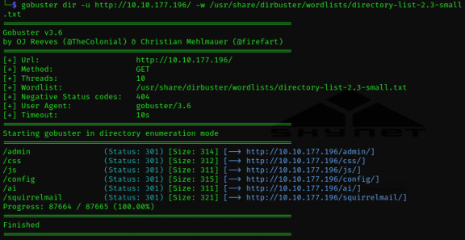</p><br>

**Hidden directories:**<br>
/admin<br>
/css<br>
/js<br>
/config<br>
/ai<br>
/squirrelmail<br>

If you had to navigate to the first 5 directories, you will find that all of them are Forbidden.<br>

<p align="center"> 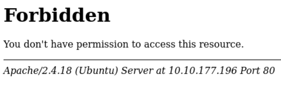</p><br>

However, */squirrelmail* brings up what looks like a webmail system (hence the open ports 110 and 143?):<br>
<p align="center"> 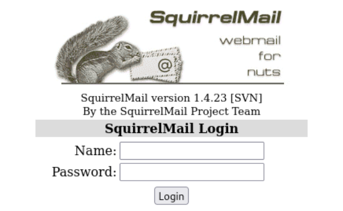</p><br>

While there is nothing we can do just as yet, it conviently discloses the version SquirrelMail is running on. **Version 1.4.23**.

<h3>SEARCHSPLOIT</h3>

```bash
searchsploit squirrelmail
```
<p align="center"> 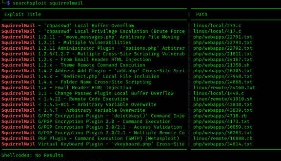</p><br>

<p>Although there are some very important information regarding SquirrelMail vulnerabilities here, there are none that pique my interest since the version of SquirrelMail we are dealing with is not referenced anywhere.</p>

<p>For now, there is not much else we can do on the webserver.</p>

<p>Let's investigate port 139.</p>

<h2>Port 139 (SMB)</h2>

<h3>SMBCLIENT</h3>
Let's use smbclient to enumerate the SMB File Share system on the server.<br>

```bash
smbclient -L \\\\[targetIP]\\ 
```

<p align="center"> 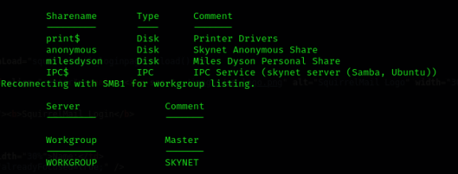</p><br>

Here we can see the different SMB shares currently on the server. There is also a possible username: **milesdyson**. Let's see what we can access.

**Anonymous**
<p>The first share that catches my attention is the anonymous share. This will allow us to enter without specifying a username or password.</p>

```bash
smbclient \\\\[targetIP]\\anonymous
```
*(notice the removal of the ```-L``` switch since we are now not listing the shares, but rather connecting to, in this case **anonymous** as specified on ```\\anonymous```)*<br>

<p align="center"> 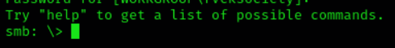</p><br>

We are in.<br>

Let's see what this share contains.<br>

```bash
ls
```
<p align="center"> 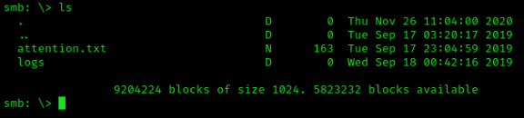</p><br>

<p>Here we have a file called attention.txt and a directory called logs.</p>

Lets download *attention.txt* on our local machine.<br>

```bash
get attention.txt
```

<p align="center"> 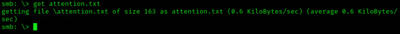</p><br>

<p>We will get to that later.</p>

Change directory to the directory *logs* so we can check what there is inside.<br>

```bash
cd logs
```

<p align="center"> 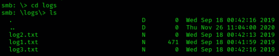</p><br>

They look like log files. We need to investigate these and see if we can capture important data. Let's download them to our local machine using the ```get``` command like before.<br>

<p align="center"> 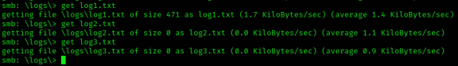</p><br>

Now that we have all the content that was on the *anonymous* share stored on our local machine, lets start seeing what they contain.<br>

Open another terminal instance and list the contents of *attention.txt* on your screen.<br>

```bash
cat attention.txt
```
*(if this does not work, make sure you are in the same directory that attention.txt is located)*<br>

<p align="center"> 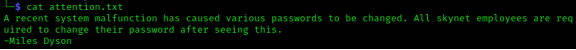</p><br>

*A recent system malfunction has caused various passwords to be changed. All skynet employees are required to change their password after seeing this.*<br>
*-Miles Dyson*

Hmm, this is interesting. This might mean that we can attempt to brute force the passwords in some way. There goes **Miles** again, to further increease the odds that its a username.<br>

<p>Let's first list the contents of the log files to see if the mean anything to us.</p>

<p align="center"> 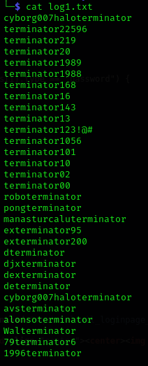</p><br>

The contents of *log1.txt* seem to be a list of logged passwords! We can use these in our brute force attempt later on.

*log2.txt* and *log3.txt* are empty.

<p>Before delving deeper in this, let's investigate the other SMB shares to see if they hold any more useful data.</p>

Head back to your terminal tab where you had the ```smbclient``` running and try and access the *IPC$* share.<br>

<p align="center"> 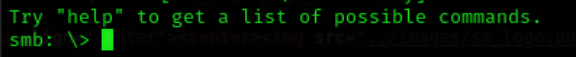</p><br>

Running the ```ls``` command will give an error, letting us know that no files exist within that share, making the share useless for us.<br>

<p align="center"> 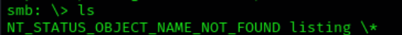</p><br>

**Tip: Type command** ```exit``` **to exit the current share you're in.**

Both shares *print$* and *milesdyson* will give an Access Denied error when attempting to access them.<br>

With regards to port 139, it seems that there are no more clues for us to uncover. Let's go back to port 80 and attempt to brute force the SquirrelMail login using *milesdyson* as username and the password list found on *log1.txt*.<br>

<h2>Port 80 (HTTP) Revisited:</h2>

For this, we will use *Burpsuite* to insert the password list as the payload to attempt to break in.

<h3>BURPSUITE</h3>

<p>Launch Burpsuite</p>

<p align="center"> 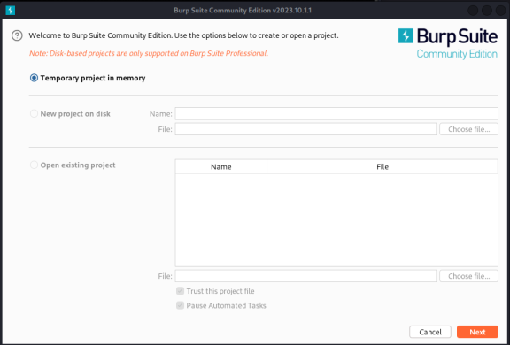</p><br>

<p>Hit Next and Start Burp on the next screen.</p>

***Disclaimer:***
*For this to work, you need to set up a proxy to be able to intercept traffic. In our case, we are using FoxyProxy. This is a FireFox extension that will allow us to do all the testing we require.*

<p align="center"> 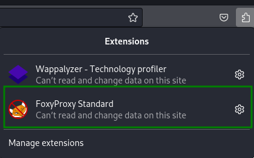</p><br>

And these are the settings you need to add:

<p align="center"> 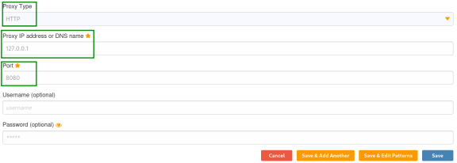</p><br>

<p>When that is done, you will be able to switch to it using the extension.</p>


